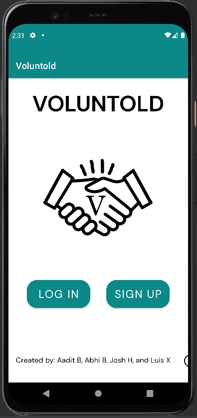

# Voluntold

Voluntold is an app built as a senior capstone project for our mobile app development class. Our inspiration for the project was the lack of 
a centralized volunteer opportunity database for high schoolers as many of our peers were trying to find ways to contribute to our local
community but didn't know how. That's why we built Voluntold. Voluntold is an app similar to Indeed or Chegg except for volunteering instead
of internships. Both potential volunteers and organizations looking for volunteers can sign up for this app, allowing both sides to interact
like never before.

## Features
- Volunteers can create a profile and view volunteer opporunities posted by organizations
- Volunteers can sign up for opportunities and get verification from the organization after participating
- Volunteers can track opportunities and search/filter for specific ones as well

- Organizations can create a company profile and post volunteer opportunities
- Organizations can post updates about their work or any other news they want to share
- Organizations can verify the participation of a volunteer straight from the app

## Tech Stack
- Firebase Authentication/Database
- Java on Android Studio

## Contributors
- Aadit Bennur
- Luis Xu
- Josh Hsu
- Abhi Bhashyam
